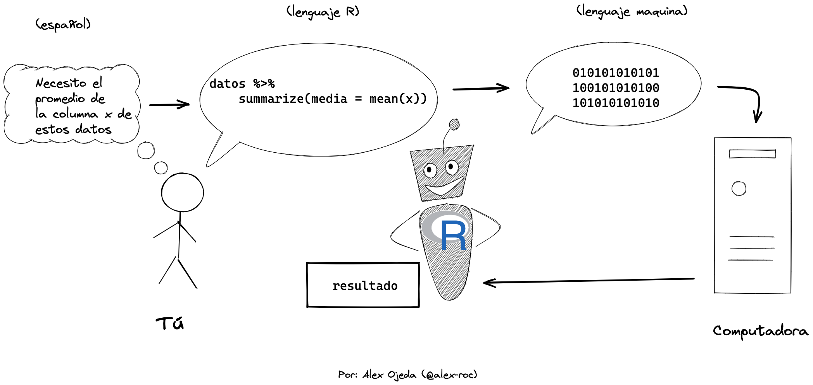

## ¿Qué es R?

R es un sistema para la estadística computacional. Pero es más sencillo entenderlo como un lenguaje de programación y un interprete que traduce ese lenguaje a operaciones computacionales útiles sobre datos.


Es decir que para comunicarte con R debes escribir en "código".

## Instalar R y RStudio

- R, que es el software base: https://cloud.r-project.org/
- RStudio, que es el editor de código: https://www.rstudio.com/products/rstudio/download/

RStudio tiene las siguientes partes principales:


- Editor de texto: Donde podemos abrir nuestros archivos de R (`.R` y `.Rmd`) y escribir varias lineas de código, para luego ejecutarlo ya sea por linea, bloque o archivo entero. Toma atención al botón 'Run' y 'Source'.
- Consola: Donde podemos escribir código de forma interactiva (comando y respuesta inmediata) o ver las salidas de nuestro código del editor de texto.
- Entorno: Donde veremos los objetos de R que están disponibles en memoria: variables, tablas de datos, funciones, etc.
- Archivos/Gráficos: Donde podemos ver los archivos que existen en nuestro proyecto y los gráficos, entre otros.

Siempre que trabajemos con R es clave que creemos "Proyectos" en RStudio:

- Un "Proyecto" no es más que una carpeta donde podemos crear varios archivos de R, datos, documentación y guardar salidas, que además facilita que sean accesibles para nuestros programas en R. 
- Para crearlo ve a: File > New Project, escoge un directorio y dale un nombre
- Una vez creado el proyecto, el punto de partida es crear tú primer archivo de R. Para ello: File > New File > R Script
- En un R Script ya puedes escribir código en R

## Evaluación

R espera tus instrucciones. Pero solo puedes comunicarte bien con él de forma escrita a traves del lenguaje de R, que tiene su propia semántica, sintaxis y hasta pragmática. Las interfaces gráficas (GUI) con sus menus e iconos no son tan expresivas como escribir
en editores de texto o en consolas (CLI).

Al proceso de "interpretación" de lo que le digas textualmente a R se lo conoce como "evaluación". Si cumples con las reglas de semántica y sintaxis adecuada, entonces R evaluará bien tus instrucciones y realizará las operaciones que necesitas.

Hay dos tipos generales de instrucciones que puedes darle: declaraciones y expresiones.

## Declaraciones (_statements_)
Las declaraciones son instrucciones de acción simples que se ejecutan de inmediato:

- Asigna el dato de la derecha a esta variable: `primer_parcial <- 55`
- Imprime el contenido de este dato: `print(primer_parcial)`
- Crea esta función: `cuadrado <- function(x) x * x`

## Expresiones (_expressions_)

Las expresiones son una combinación compleja de declaraciones, funciones, variables y datos que se evaluan a un valor usable, por ejemplo:
```{r, eval = F}
resultado <- sum(primer_parcial * 1, segundo_parcial * 2, tercer_parcial * 3) / sum(1:3)
```

Más adelante definiremos de forma más precisa todos estos terminos. Lo importante ahora es ver que con el lenguaje de R se pueden expresar cosas complejas.

## Comentarios (_comments_)

Hay un texto especial que no es evaluado por R, pero que sirve para que anotemos nuestras ideas en nuestro propio idioma y se llaman comentarios. Se marcan con un simbolo de `#`.
```{r}
# este comentario no se evalua, pero sirve para hacer anotaciones para uno mismo o para otros

sum(2, 2) # esta linea de codigo suma dos más dos
```

## Secuencia de instrucciones (_scripts_)

Normalmente escribiras muchas expresiones, declaraciones, funciones y variables combinadas en un solo archivo, que será una especie de "guión" (script) que R deberá ejecutar. Estos archivos normalmente se ejecutan de arriba hacía abajo secuencialmente, por ejemplo:

```{r}
primer_parcial <- 55 # asigna un valor a una variable
segundo_parcial <- 40 # idem
tercer_parcial <-70 # idem
resultado <- sum(primer_parcial * 1, segundo_parcial * 2, tercer_parcial * 3) / sum(1:3) # la expresión se evalua a un valor y se asigna a la variable resultado
print(resultado) # se imprime o muestra el contenido de la variable resultado
```

Estos scripts se pueden guardar en diferentes archivos que terminan en la extensión `.R`. Estos serán los "programas" que crearás y que R interpretará.

## Referencias
- https://cran.r-project.org/doc/manuals/r-devel/R-lang.html

[Siguiente >>](https://github.com/lab-tecnosocial/curso-r/tree/main/01-datos-y-variables)
