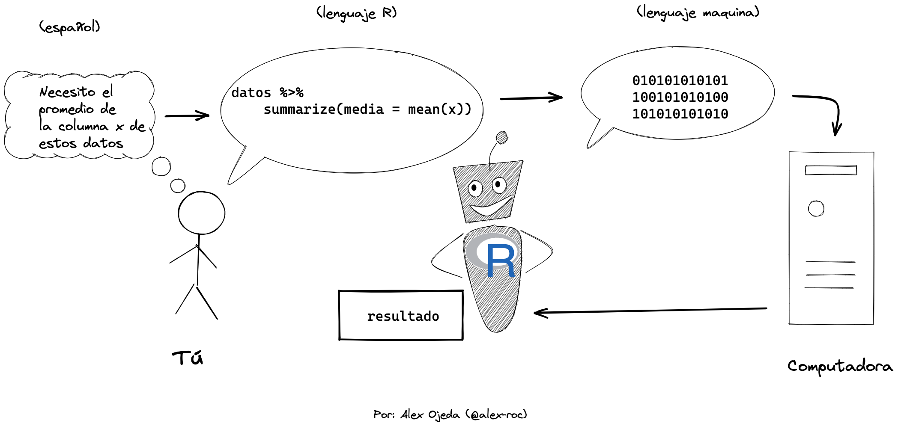

R como interprete
================

## ¿Qué es R?

R es un sistema para la estadística computacional. Pero es mejor
entenderlo tanto como un lenguaje de programación y un interprete que
traduce ese lenguaje a operaciones computacionales útiles sobre datos.

 Es decir que para
comunicarte con R debes usar un “código” en R.

## Evaluación

R espera tus instrucciones. Pero solo puedes comunicarte bien con él de
forma escrita a traves del lenguaje de R, que tiene su propia semántica,
sintaxis y hasta pragmática. Las interfaces gráficas (GUI) con sus menus
e iconos no son tan expresivas como escribir comandos de texto en
consolas (CLI) o editores de texto.

Al proceso de “interpretación” de lo que le digas textualmente a R se lo
conoce como “evaluación”. Si cumples con las reglas de semántica y
sintaxis adecuada, entonces R evaluará bien tus instrucciones y
realizará las operaciones que necesitas.

Hay dos tipos generales de instrucciones que puedes darle: declaraciones
y expresiones.

## Declaraciones (*statements*)

Las declaraciones son instrucciones de acción simples que se ejecutan de
inmediato:

-   Asigna el dato de la derecha a esta variable: `primer_parcial <- 55`
-   Imprime el contenido de este dato: `print(primer_parcial)`
-   Crea esta función: `cuadrado <- function(x) x * x`

## Expresiones (*expressions*)

Las expresiones son una combinación compleja de declaraciones,
funciones, variables y datos que se evaluan o reducen a un valor usable,
por ejemplo:

``` r
resultado <- sum(primer_parcial * 1, segundo_parcial * 2, tercer_parcial * 3) / sum(1:3)
```

Más adelante definiremos de forma más precisa todos estos terminos.Lo
importante ahora es ver que con el lenguaje de R se pueden expresar
cosas complejas.

## Comentarios (*comments*)

Hay un texto especial que no es evaluado por R, pero que sirve para que
anotemos nuestras ideas en nuestro propio idioma y se llaman
comentarios. Se marcan con un simbolo de `#`.

``` r
# este comentario no se evalua, pero sirve para hacer anotaciones para uno mismo o para otros

sum(2, 2) # puedo anotar la utilidad de esta expresión: esta linea de codigo suma dos más dos
```

    ## [1] 4

## Secuencia de instrucciones (*scripts*)

Normalmente escribiras muchas expresiones, declaraciones, funciones y
variables combinadas en un solo archivo, que será una especie de “guión”
(script) que R deberá ejecutar, paso a paso. Estos archivos normalmente
se ejecutan de arriba hacía abajo secuencialmente, por ejemplo:

``` r
primer_parcial <- 55 # asigna un valor a una variable
segundo_parcial <- 40 # idem
tercer_parcial <-70 # idem
resultado <- sum(primer_parcial * 1, segundo_parcial * 2, tercer_parcial * 3) / sum(1:3) # la expresión se evalua a un valor y se asigna a la variable resultado
print(resultado) # se imprime o muestra el contenido de la variable resultado
```

    ## [1] 57.5

Estos scripts se pueden guardar en diferentes archivos que terminan en
la extensión `.R`. Estos serán los “programas” que crearás y que R
interpretará.

## Referencias

-   <https://cran.r-project.org/doc/manuals/r-devel/R-lang.html>
