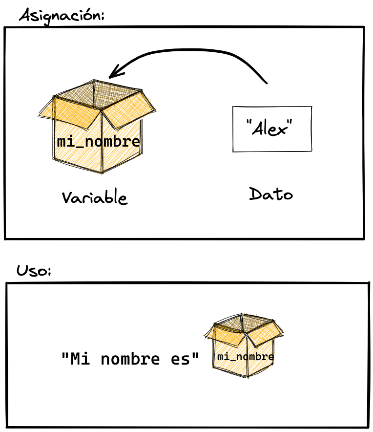

## R como una calculadora

Inicialmente, puedes usar R como una calculadora.Usar varias operaciones aritméticas, incluidas la adición, sustracción, multiplicación, división, exponenciación y módulo:

-   Adición:`+`
-   Sustracción: `-`
-   Multipliación:`*`
-   División: `/`
-   Exponenciación:`^`
-   Modulo:`%%`

## Variables

Una variable es un nombre al que asignamos un valor u objeto. Permite almacenarlos y luego referenciarlos para acceder al valor u objeto almacenado, usarlo o combinarlo. 

{width=50%}

Para ello se debe usar el operador de asignación:

> `<-`

```{r}
mis_platanos <- 5
mis_manzanas <- 2
mis_frutas <- mis_platanos + mis_manzanas
print(mis_frutas)
```


> Demostración: Calcular el promedio de una materia

> Ejercicio: Usando variables, calcular un salario mensual restando sus impuestos

## Tipos de datos

Son los tipos de valores que pueden soportar las variables. Los tres fundamentales son: númerico, texto y lógico:

```{r}
# Numérico
mi_numero_1 <- 66
mi_numero_2 <- 66.55

# Texto o caracter
mi_texto <- "Alex" # fundamental: notese que el texto siempre lleva comillas para diferenciarlo de los nombres de variables y otros símbolos de programación

# Lógico
mi_logico <- TRUE # solo se acepta TRUE o FALSE, escritoas de forma abreviada también T y F

# verificar su tipo con la función class()
class(mi_numero_1)
class(mi_numero_2)
class(mi_texto)
class(mi_logico)
```

Cada tipo de dato permite o se restringe a ciertas operaciones.

Existen otros tipos de datos como las fechas, tiempos, factores, geopuntos, etc., que son más especializados.

## Dos funciones básicas y útiles: `print()` y `paste()`

Algo que haremos todo el tiempo es motrar el contenido de una variable. Para ello utilizaremos la función `print()` que imprime en pantalla el contenido de la variable que le pasemos. Opcionalmente también podemos simplemente escribir el nombre de la variable para el mismo resultado:

```{r}
print(mi_texto) # con la función print()
mi_texto # simplemente escribiendo el nombre de la variable
```

También, algo que haremos a menudo, es combinar los valores de la variables entre ellas y con texto. Para ello podemos usar la función `paste()`:

```{r}
paste("Mi nombre es", mi_texto)
```

> Ejercicio: Calcular el descuento de salario mensual pero esta vez imprimiendo los resultados con información contextual útil

[<< Anterior](https://github.com/lab-tecnosocial/curso-r/tree/main/00-R-como-interprete)   |   [Siguiente >>](https://github.com/lab-tecnosocial/curso-r/tree/main/02-funciones)
