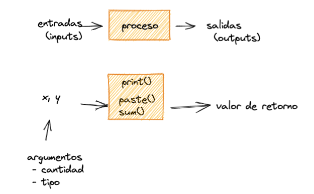
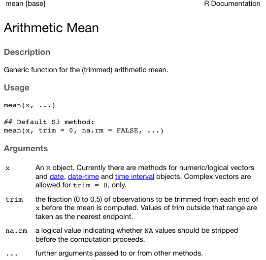

Funciones
================

## Concepto

Una función es un procedimiento que recibe unos datos y parametros
(entradas) y devuelve un resultado (salida).Puedes entenderlo como un
mini sistema:



Podemos diferenciar entre tres tipos de funciones, según quién lo creo:

-   Incorporadas (*built-in*). Son aquellas que ya vienen por defecto en
    R y estaán listas para usarlas. Por ejemplo, `paste()`, `print()`,
    `sum()`, etc.
-   Definidas por el usuario. Son aquellas que el propio usuario puede
    crear y utilizar.
-   Definidas y agrupadas en otros paquetes o librerias (vitos más
    adelante).

Para definir una función es útil tomar en cuenta las siguientes
consideraciones:

-   Piensa en resolver un problema bien definido, que será el objetivo
    de la función. Aquí piensa en el punto de partida de la función
    (entradas o “argumentos”): los datos e información necesaria.
-   Piensa en un procedimiento que resolverá el problema. Un
    procedimiento es una secuencia ordenada de pasos. Aquí puedes hacer
    tus propias operaciones y llamar a otras funciones de ser necesario.
-   Piensa en el resultado final que devolverá tu función.

Crear funciones es una forma de empaquetar una serie de acciones útiles
que podemos reusar en varias instancias del problema que resuelve la
función. La función luego se vuelve una caja negra que podemos usar como
un bloque simple para construir soluciones más complejas.Si ves que
estás usando un mismo bloque de código varias veces, copiandolo y
cambiando sus datos principales, entonces ese bloque de código es un
buen candidato para una función.

## Sintaxis

Para la creación de funciones hay que seguir la siguiente sintaxis:

``` r
my_fun <- function(arg1, arg2) { # cabeza
  # cuerpo
}
```

Es similar a crear variables, pero en vez de asignar un valor se asigna
una función. Notar que:

-   Se debe usar la palabra reservada `function`
-   Esta lleva entre parentesis los “argumentos” (entradas) necesarios,
    que pueden ser 0 o más. Piensese en los argumentos como una suerte
    de variables locales que se pasan desde la cabeza de la función al
    cuerpo.
-   En el cuerpo, que está entre llaves `{ }`, se procesan los
    argumentos secuencialmente.

Ejemplo:

``` r
# Crear una función que devuelve la potencia de dos de cualquier número
potencia_dos <- function(x){
  x * x
}
```

En R la última linea del cuerpo de la función es la que se devuelve.
También se puede ser explicito y usar la función `return()`.

Una vez que hemos definido una función, podemos usarla de la siguiente
forma:

``` r
potencia_dos(4)
```

    ## [1] 16

``` r
potencia_dos(8)
```

    ## [1] 64

``` r
potencia_dos(1432)
```

    ## [1] 2050624

Notese que hemos llamado a la función por su nombre y además hemos
pasado los argumentos necesarios entre parentesis.

## Argumentos

R puede emparejar argumentos *por posición* y *por nombre*. Veamos otro
ejemplo para ilustrar estos puntos:

``` r
# Definimos una función
potencia_n <- function(base, potencia){
  base ^ potencia
}

# Pasamos argumentos por posición
potencia_n(2, 8)
```

    ## [1] 256

``` r
# Pasamos argumentos por nombre
potencia_n(base = 2, potencia = 8)
```

    ## [1] 256

También puede haber argumentos *por defecto*:

``` r
potencia_n <- function(base, potencia = 2){
  base ^ potencia
}

potencia_n(base = 2) # no es necesario especificar el segundo argumento para que la función se ejecute sin problemas
```

    ## [1] 4

## Documentación de una función

Tanto cuando definamos una función propia o usemos una ya definida, se
hace esencial entender cómo usarla. Y para ello cada función tiene una
documentación que puede ser consultada de la siguiente forma:

``` r
help(mean)
?mean
```



La función `help()` o su abrevación `?` muestran la documentación. Allí
podemos ver la descripción de la función, los argumentos que recibe, el
valor de retorno y ejemplos de uso.

Asimismo, con la función `args()` podemos ver solo los argumentos.

``` r
args(mean)
```

    ## function (x, ...) 
    ## NULL

## Composibilidad: Funciones dentro de funciones

Las funciones se pueden componer, también llamado “anidamiento”
(*nesting*) de funciones. Es decir usar funciones dentro de funciones,
con lo que se puede crear procedimientos más complejos:

``` r
nombre <- "Alex"
prom_semestre1 <- 72
prom_semestre2 <- 55

print(paste(toupper(nombre), "tu promedio general es:",  sum(prom_semestre1, prom_semestre2) / 2))
```

    ## [1] "ALEX tu promedio general es: 63.5"

La evaluación de las funciones compuestas se da de adentro hacía afuera.

## Más ejemplos

Funcion que recibe un numero cualquiera y lo devuelve triplicado

``` r
triplicar <- function(n){
  n * 3
}
triplicar(10)
```

    ## [1] 30

funcion que recibe dos numeros y eleva el primero al segundo

``` r
potenciar <- function(base, potencia){
  base ^ potencia
}
potenciar(2, 4)
```

    ## [1] 16

funcion que recibe tu edad y te dice que año naciste

``` r
calc_nacimiento <- function(edad){
  anio_actual <- 2022
  anio_nacimiento <- anio_actual - edad
  cat("Naciste el año:", anio_nacimiento)
}
calc_nacimiento(36)
```

    ## Naciste el año: 1986

funcion que calcula tu IMC (indice de masa corporal). Peso en Kg y
altura en Metros

``` r
imc <- function(peso, altura){
  peso / altura ^ 2
}

imc(87, 1.72) # bien
```

    ## [1] 29.40779

``` r
imc(1.72, 87) # orden incorrecto
```

    ## [1] 0.0002272427

``` r
imc(peso = 87, altura = 1.72) # con argumentados nombrados
```

    ## [1] 29.40779

[\<\<
Anterior](https://github.com/lab-tecnosocial/curso-r/tree/main/01-datos-y-variables)
\| [Siguiente
\>\>](https://github.com/lab-tecnosocial/curso-r/tree/main/03-estructuras-de-datos)
