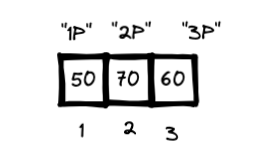

## Vectores

Las variables que hemos definido hasta ahora solo han poseido un valor único. Pero muchas veces necesitamos almacenar una colección o serie de valores relacionadas.

Para eso están los vectores, que son una colección unidimensional de elementos del mismo tipo. Se los crea con la función:

> `c()` 

que viene de `c`ombinar:

```{r}
# Ejemplo de creación de vectores
notas_algebra <- c(50, 70, 60) # numerico: entero
notas_historia <- c(90.5, 99.8, 90.1) # numerico: decimal
top_materias <- c("Teoría de grafos", "Historia", "Estadistica") # texto o caracteres
aprobacion_algebra <- c(FALSE, TRUE, FALSE) # logicos
```

### Operaciones

Las operaciones con los vectores son especiales:

- Un valor único (escalar) contra un vector resulta en el valor siendo aplicado varias a todos los elementos del vector
- Si se opera un vector de la misma longitud contra otro vector, las operaciones se hacen por parejas.
- Si se pasa un vector a una función que recibe vectores, la función utiliza todos los elementos del vector para su operación

```{r}
# operaciones con vectores
notas_algebra * 2
(notas_algebra + notas_historia) / 2
sum(notas_algebra)
mean(notas_algebra) # media
sd(notas_algebra)   # desviación estandar

```
### Selección de elementos de vectores (subconjuntos)

Para poder seleccionar los elementos de los vectores es importante primero entender cómo están almacenados, como ejemplo usemos el vector `notas_algebra`:



Se pueden pensar los vectores como cajas alineadas consecutivamente. Los elementos de las cajas tienen un índice númerico correlativo que empieza en 1. Opcionalmente los elementos también pueden tener nombres.

```{r}
# vector con indices vs. vector con nombres
notas_algebra_indices <- c(50, 70, 60)
notas_algebra_nombres <- c("1P" = 50, "2P" = 70, "3P" = 60)
```

Ahora para acceder a los elementos se debe usar el operador de subconjunto:
> `[]`

```{r}
# selección o subconjuntos por indice
notas_algebra_indices[1]
notas_algebra_indices[3]
notas_algebra_indices[1:2]
notas_algebra_indices[c(1, 3)]
cat("---\n")
# selección o subconjuntos por nombre
notas_algebra_nombres["2P"]
notas_algebra_nombres[c("1P", "3P")]

```

También es posible seleccionar con valores lógicos:
```{r}
notas_algebra[c(TRUE, FALSE, FALSE)]
```
Eso implica que podemos pasar una expresión comparativa que devuelva valores lógicos y que nos sirva para filtrar. Para ello, antes, debemos conocer dos tipos nuevos de operadores que nos ayudarán a construir esas expresiones:

Operadores de comparación:

- `<`  menor que
- `>`  mayor que
- `<=` menor o igual que
- `>=` mayor o igual que
- `==` igual a
- `!=` no igual a

Operadores lógicos:

- `&` (y): solo devuelve verdadero si ambos verdaderos
- `|` (o): devuelve falso cuando los dos son falsos
- `!` (no): cambiar el valor de verdadero a falso y viceversa

```{r}
# defino un vector del 1 al 20
mi_vector <- 1:20

# operaciones de comparación (devuelven valore lógicos)
mi_vector > 10
mi_vector >= 5 & mi_vector <= 15
mi_vector == 10 | mi_vector == 20

# filtrar (pasamos la expresión dentro de los corchetes)
mi_vector[mi_vector > 10]

```


## Matrices

Sirven para almacenar datos de un solo tipo que tienen dos dimensiones, estilo tablas.

Se las crea con la función `matrix()` o vinculando dos o más vectores por columna (`cbind()`) o fila (`rbind()`):
```{r}
# matrices
numeros <- 1:12
mi_matriz <- matrix(numeros, nrow = 3, ncol = 4)
notas_general <- cbind(notas_algebra, notas_historia)

# seleccion de matricez
mi_matriz[2, 2]
```

Tienen operaciones y modos de selección similares a los vectores.