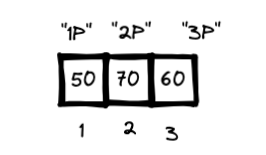
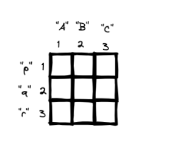

# Estructuras de datos

# Vectores

## Concepto

Las variables que hemos definido hasta ahora solo han poseido un valor
único. Pero muchas veces necesitamos almacenar una colección o serie de
valores relacionados.

Para eso están los vectores, que son una colección unidimensional de
elementos del mismo tipo. Se los crea con la función:

> `c()`

que viene de `c`ombinar:

``` r
# Ejemplo de creación de vectores
notas_algebra <- c(50, 70, 60) # numerico: entero
notas_historia <- c(90.5, 99.8, 90.1) # numerico: decimal
top_materias <- c("Teoría de grafos", "Historia", "Estadistica") # texto o caracteres
aprobacion_algebra <- c(FALSE, TRUE, FALSE) # logicos
```

## Operaciones

Las operaciones con los vectores son especiales:

-   Un valor único (escalar) contra un vector resulta en el valor siendo
    aplicado varias a todos los elementos del vector
-   Si se opera un vector de la misma longitud contra otro vector, las
    operaciones se hacen por parejas entre cada elemento del primer
    vector y el segundo.
-   Si se pasa un vector a una función que recibe vectores, la función
    utiliza todos los elementos del vector para su operación

``` r
# operaciones con vectores
notas_algebra * 2
```

    ## [1] 100 140 120

``` r
(notas_algebra + notas_historia) / 2
```

    ## [1] 70.25 84.90 75.05

``` r
sum(notas_algebra)
```

    ## [1] 180

``` r
mean(notas_algebra) # media
```

    ## [1] 60

``` r
sd(notas_algebra)   # desviación estandar
```

    ## [1] 10

También suele ser muy útil saber la longitud o cantidad de elementos de
un vector con la función `length()`:

``` r
length(notas_algebra)
```

    ## [1] 3

## Selección de elementos de vectores (subconjuntos)

Para poder seleccionar los elementos de los vectores es importante
primero entender cómo están almacenados los elementos en un vecto, como
ejemplo usemos el vector `notas_algebra`:



Se pueden pensar los vectores como cajas alineadas consecutivamente. Los
elementos de las cajas tienen un índice númerico correlativo que empieza
en 1. Opcionalmente los elementos también pueden tener nombres que se
pueden asignar directamente en el vector o posteriormente con la función
`names()`:

``` r
# vector con indices vs. vector con nombres
notas_algebra_indices <- c(50, 70, 60)
notas_algebra_nombres <- c("1P" = 50, "2P" = 70, "3P" = 60)
names(notas_algebra_nombres) <- c("1P", "2P", "3P") # alternativa a lo anterior, pero da el mismo resultado
```

Ahora para acceder a los elementos se debe usar el operador de
subconjunto, que son dos corchetes:

> `[]`

``` r
# selección o subconjuntos por indice
notas_algebra_indices[1]
```

    ## [1] 50

``` r
notas_algebra_indices[3]
```

    ## [1] 60

``` r
notas_algebra_indices[1:2]
```

    ## [1] 50 70

``` r
notas_algebra_indices[c(1, 3)]
```

    ## [1] 50 60

``` r
cat("---\n")
```

    ## ---

``` r
# selección o subconjuntos por nombre
notas_algebra_nombres["2P"]
```

    ## 2P 
    ## 70

``` r
notas_algebra_nombres[c("1P", "3P")]
```

    ## 1P 3P 
    ## 50 60

También es posible seleccionar con valores lógicos:

``` r
notas_algebra[c(TRUE, FALSE, FALSE)]
```

    ## [1] 50

Eso implica que podemos pasar una expresión comparativa que devuelva
valores lógicos y que nos sirva para filtrar. Para ello, antes, debemos
conocer dos tipos nuevos de operadores que nos ayudarán a construir esas
expresiones:

Operadores de comparación:

-   menor que: `<`  
-   mayor que: `>`  
-   menor o igual que: `<=`
-   mayor o igual que: `>=`
-   igual a: `==`
-   no igual a: `!=`

Operadores lógicos:

-   y: `&` (devuelve `TRUE` si ambos valores son verdaderos)
-   o: `|` (devuelve `FALSE` cuando los dos valores son falsos)
-   no: `!` (cambia el valor de verdadero a falso y viceversa)

``` r
# defino un vector del 1 al 20
mi_vector <- 1:20

# operaciones de comparación (devuelven valore lógicos)
mi_vector > 10
```

    ##  [1] FALSE FALSE FALSE FALSE FALSE FALSE FALSE FALSE FALSE
    ## [10] FALSE  TRUE  TRUE  TRUE  TRUE  TRUE  TRUE  TRUE  TRUE
    ## [19]  TRUE  TRUE

``` r
mi_vector >= 5 & mi_vector <= 15
```

    ##  [1] FALSE FALSE FALSE FALSE  TRUE  TRUE  TRUE  TRUE  TRUE
    ## [10]  TRUE  TRUE  TRUE  TRUE  TRUE  TRUE FALSE FALSE FALSE
    ## [19] FALSE FALSE

``` r
mi_vector == 10 | mi_vector == 20
```

    ##  [1] FALSE FALSE FALSE FALSE FALSE FALSE FALSE FALSE FALSE
    ## [10]  TRUE FALSE FALSE FALSE FALSE FALSE FALSE FALSE FALSE
    ## [19] FALSE  TRUE

``` r
# filtrar (pasamos la expresión dentro de los corchetes)
mi_vector[mi_vector > 10]
```

    ##  [1] 11 12 13 14 15 16 17 18 19 20

# Matrices

## Concepto

Sirven para almacenar datos de un solo tipo que tienen dos dimensiones,
al estilo de las tablas.

Se las crea con la función `matrix()`, donde al menos hay que pasar como
argumentos un vector, el número de filas (`nrow`) y el número de
columnas (`ncol`):

``` r
# con la funcion matrix()
numeros <- 1:12
mi_matriz <- matrix(numeros, nrow = 3, ncol = 4) # matriz 3x4
mi_matriz
```

    ##      [,1] [,2] [,3] [,4]
    ## [1,]    1    4    7   10
    ## [2,]    2    5    8   11
    ## [3,]    3    6    9   12

También se puede crear matrices combinando dos o más vectores existentes
por columna (`cbind()`) o fila (`rbind()`):

``` r
# con cbind()
notas_algebra <- c(50, 70, 60)
notas_historia <- c(90.5, 99.8, 90.1) 
notas_general <- cbind(notas_algebra, notas_historia)
notas_general
```

    ##      notas_algebra notas_historia
    ## [1,]            50           90.5
    ## [2,]            70           99.8
    ## [3,]            60           90.1

Su estructura posee, como los vectores, indices y nombres, pero esta vez
en dos dimensiones:



Entonces tiene modos de selección similares a los vectores, pero con dos
elementos:

``` r
# seleccion de matrices
mi_matriz[2, 2] # elemento de la segunda fila y segunda columna
```

    ## [1] 5

``` r
mi_matriz[ , 3] # toda la tercera columna
```

    ## [1] 7 8 9

``` r
mi_matriz[1, ] # toda la primera fila
```

    ## [1]  1  4  7 10

Mientras nombrar sus elementos y seleccionarlos por su nombre se daría
de la siguiente forma:

``` r
colnames(mi_matriz) <- c("A", "B", "C", "D")
rownames(mi_matriz) <- c("p", "q", "r")
mi_matriz
```

    ##   A B C  D
    ## p 1 4 7 10
    ## q 2 5 8 11
    ## r 3 6 9 12

``` r
mi_matriz["p", "A"]
```

    ## [1] 1

También se pueden hacer operaciones con matrices:

``` r
mi_matriz * 2 # duplicar todos sus elementos
```

    ##   A  B  C  D
    ## p 2  8 14 20
    ## q 4 10 16 22
    ## r 6 12 18 24

``` r
rowSums(mi_matriz) #sumar filas
```

    ##  p  q  r 
    ## 22 26 30

``` r
colSums(mi_matriz) # sumar columnas
```

    ##  A  B  C  D 
    ##  6 15 24 33

# Ejercicio: Media y desviación estandar

## Problemas

Ahora que conoces sobre variables, funciones y vectores puedes realizar
los dos siguientes retos.

**Problema 1.** Define una función que devuelve la media de cualquier
vector numérico, según la siguiente formula:


Donde:

-   
    es el simbolo de la media
-   
    es la cantidad total de datos o la longitud del vector
-   
    es la sumatoria de todos los elementos de
    
    a
    
-   
    es cada elemento de la serie de valores, cada elemento del vector
    identificado con su indice

En terminos simples, la fórmula solo dice:

-   Suma cada uno de los elementos del vector
-   Multiplicalo por 1 dividido por la longitud del vector, lo que es lo
    mismo que directamente dividirlo por su longitud

**Problema 2.** Define una función que devuelva la desviación estandar
de cualquier vector, según la siguiente fórmula:

^2}{n - 1}")

Esta fórmula usa los mismos símbolos ya definidos en la fórmula de la
media.

En terminos simples, la fórmula solo dice: - Restar a cada elemento la
media. Esto para ver cuánto se desvian de ella - Elevar al cuadrado cada
elemento - Sumar los resultados de los elementos anteriores - Dividirla
entre la cantidad de datos menos uno - Finalmente, extraer su raiz
cuadrada

> Tip: ten en mente todas las funciones que necesitaras para tu propia
> función, incluyendo sumatoria, longitud de vectores, operador de
> potencias. Y necesitarás averiguar la función que sirva para extraer
> raices cuadradas

## Soluciones

Existen varias formas de resolver estos ejercicios. Aquí van algunas:

``` r
# Media con asignaciones de variables intermedias
mi_media1 <- function(x) {
  suma <- sum(x)
  n <- length(x)
  suma / n      # también podría haber sido : return(suma / n)
}

# Media con funciones anidadas
mi_media2 <- function(x){
  sum(x) / length(x)
}

# Uso
datos_ejemplo <- c(10, 20, 30, 40, 50)
mi_media1(datos_ejemplo)
```

    ## [1] 30

``` r
mi_media2(datos_ejemplo)
```

    ## [1] 30

``` r
mean(datos_ejemplo) # comparamos el resultado con la funcion nativa de R
```

    ## [1] 30

``` r
# Desviación estandar con asignaciones de variables intermedias
desv_estandar2 <- function(x){
  media <- mean(x)
  n <- length(x) 
  desviaciones <- x - media
  cuadrados <- desviaciones ^ 2
  suma <- sum(cuadrados)
  division <- suma / (n - 1)
  resultado <- sqrt(division)
  resultado
}

# Desviación estandar con funciones anidadas
desv_estandar1 <- function(x){
  sqrt(sum((x - mean(x)) ^ 2) / (length(x) - 1))
}

# Uso
desv_estandar1(datos_ejemplo)
```

    ## [1] 15.81139

``` r
desv_estandar2(datos_ejemplo)
```

    ## [1] 15.81139

``` r
sd(datos_ejemplo) # comparamos el resultado con la funcion nativa de R
```

    ## [1] 15.81139

# Factores

## Concepto

A veces necesitamos almacenar variables categóricas que tienen un un
conjunto conocido y fijo de valores, y que no son propiamente datos de
tipo numérico y tampoco de tipo texto. Para ello en R existen los
“factores”.

Los factores se crean con la función `factor()`, y pueden haber factores
sin orden (“nominales”) y con orden (“ordinales”):

``` r
# de vector a factor nominal
sexo_caracter <- c("Hombre", "Mujer", "Hombre", "Hombre", "Mujer")
sexo_factor <- factor(sexo_caracter) # nominal
sexo_factor
```

    ## [1] Hombre Mujer  Hombre Hombre Mujer 
    ## Levels: Hombre Mujer

``` r
# de vector a factor ordinal
rendimiento_caracter <- c("Bajo", "Medio", "Medio", "Alto", "Bajo")
rend_factor <- factor(rendimiento_caracter, order = TRUE, levels = c("Bajo", "Medio", "Alto")) # ordinal
rend_factor
```

    ## [1] Bajo  Medio Medio Alto  Bajo 
    ## Levels: Bajo < Medio < Alto

## Operaciones

Los factores son útiles para hacer conteos, cambiar el orden de sus
niveles y hacer clasificaciones, por ejemplo:

``` r
summary(sexo_factor)
```

    ## Hombre  Mujer 
    ##      3      2

``` r
summary(rend_factor)
```

    ##  Bajo Medio  Alto 
    ##     2     2     1

``` r
levels(sexo_factor) <- c("Mujer", "Hombre")
sexo_factor
```

    ## [1] Mujer  Hombre Mujer  Mujer  Hombre
    ## Levels: Mujer Hombre

Los factores ordinales también pueden ser comparados:

``` r
rend_factor[1] > rend_factor[2]
```

    ## [1] FALSE

Tomar en cuenta que no todo dato de texto es categórico. Si vemos texto
que no tiene un conjunto de valores conocidos y fijos, entonces estamos
frente a un tipo de dato que no nos conviene transformarlo a factor:

``` r
# no es factor o categorico
gusto_escuela <- c("Pues no me parece tan bien..", "algo jejeje", "como q si")
class(gusto_escuela)
```

    ## [1] "character"

# Data frames

## Concepto

Un problema con los vectores y matrices es que solo admiten datos del
mismo tipo. Ese es un incoveniente cuando se intenta modelar o medir una
parte de la realidad que tiene diferentes tipos de datos. Una encuesta,
por ejemplo, puede tener datos numéricos (edad), datos de texto
(opiniones), datos categóricos (idioma), fechas, etc.

Para ello, R cuenta los “*data frame*” o tablas de datos, que pueden
recibir diferentes tipos de datos en sus columnas.Un *data frame* es un
conjunto de datos de forma rectangular y que tiene variables en las
columnas y casos en las filas.

Se las crea con la función `data.frame()` (o `tibble()` como veremos más
adelante). Los argumentos que reciben son vectores de datos que pueden
tener diferentes tipos:

``` r
# Definir vectores de varios tipos
edad <- c(24, 22, 18) # numerico
sexo_caracter <- c("Hombre", "Mujer", "Hombre")
sexo_factor <- factor(sexo_caracter) # factor
gusto_universidad <- c("Pues no me parece tan bien..", "algo jejeje", "como q si") # texto

# Cear data frame a partir de los vectores anteriores
tabla <- data.frame(edad, sexo_factor, gusto_universidad)

# Ver data frame
tabla
```

    ##   edad sexo_factor            gusto_universidad
    ## 1   24      Hombre Pues no me parece tan bien..
    ## 2   22       Mujer                  algo jejeje
    ## 3   18      Hombre                    como q si

> Ejercicio: crear un data frame con 5 casos y que tengan al menos 5
> variables (dos numericas, dos factores, uno de caracter o texto)

## Operaciones básicas

Si la tabla es muy grande se pueden usar las funciones de `head()` y
`tail()` para ver su ‘cabeza’ o los primeros datos y su ‘cola’ o últimos
datos, respectivamente. También si se quiere ver su estructura se puede
usar `str()`.

Para seleccionar un subconjunto de datos se puede usar al igual que con
una matriz los indices y nombres:

``` r
tabla[1, 2]
```

    ## [1] Hombre
    ## Levels: Hombre Mujer

``` r
tabla[2, "edad"]
```

    ## [1] 22

Una operación común que haremos será elegir columnas enteras para
aplicarle alguna operación. Para ello podemos usar el operador de
selección de elemento `$`:

``` r
tabla$edad # devuelve la columna como vector
```

    ## [1] 24 22 18

Podemos, igual que en el caso de los vectores y matrices, filtrar
pasando alguna expresión comparativa:

``` r
# Definimos dos vectores de la misma longitud
estudiantes <- c("Abigail", "Dario", "Nicaela", "Javier", "Vicente")
notas <- c(30, 60, 61, 20, 10)

# Creamos el data frame y lo imprimimos
planilla <- data.frame(estudiantes, notas)
planilla
```

    ##   estudiantes notas
    ## 1     Abigail    30
    ## 2       Dario    60
    ## 3     Nicaela    61
    ## 4      Javier    20
    ## 5     Vicente    10

``` r
# Filtramos a aquellos casos que tenga igual o más de 51 en notas
planilla[planilla$notas >= 51, ]
```

    ##   estudiantes notas
    ## 2       Dario    60
    ## 3     Nicaela    61

Existen muchas más operaciones que se pueden hacer a las columnas,
incluyendo operaciones estadísticas y de visualización, que veremos
posteriormente. Aquí van algunas que ya vimos anteriormente pero con la
sintaxis adecuada para que funcionen data frames:

``` r
# algunas operaciones sobre columnas
mean(tabla$edad)
```

    ## [1] 21.33333

``` r
sd(tabla$edad)
```

    ## [1] 3.05505

``` r
summary(tabla$sexo_factor)
```

    ## Hombre  Mujer 
    ##      2      1

``` r
print(tabla$gusto_universidad)
```

    ## [1] "Pues no me parece tan bien.."
    ## [2] "algo jejeje"                 
    ## [3] "como q si"

# Leer y escribir datos

## Leer datos

Normalmente no tendremos que crear los datos primarios en R, sino
importar los datos de otra fuente (una excepción es la importación de
datos mediante consultas a APIs y el scraping). Para ello es útil saber
como “leerlos” y transformarlos a un data frame.

Las funciones de importación dependerán del formato de los datos. Los
formatos más populares y que vereos son:

-   CSV (Comma Separated Value). Un formato de simple texto plano. Si no
    lo conoces, puedes ver este video:
    <https://www.youtube.com/watch?v=SaHIUR9jIPY>
-   Excel (.xlsx)
-   SPSS (.sav)

Para leer CSV usaremos la función `read.csv()` (o alternativamente
`read_csv()` de `tidyverse`), que recibe el argumento de la **ruta**
(*path*). La ruta es donde se encuentra el archivo en tu sistema de
archivos, donde las carpetas se separan con un `/` y al último se
encuentran los nombres de archivos generalmente con una extensión de su
tipo de archivo.

Si estas en un proyecto de RStudio, que no es más que una carpeta,
entonces mueve tus archivos de datos a tu carpeta para un acceso más
directo:

``` r
datos_csv <- read.csv("datos/gapminder.csv")
head(datos_csv)
```

    ##       country continent year lifeExp      pop gdpPercap
    ## 1 Afghanistan      Asia 1952  28.801  8425333  779.4453
    ## 2 Afghanistan      Asia 1957  30.332  9240934  820.8530
    ## 3 Afghanistan      Asia 1962  31.997 10267083  853.1007
    ## 4 Afghanistan      Asia 1967  34.020 11537966  836.1971
    ## 5 Afghanistan      Asia 1972  36.088 13079460  739.9811
    ## 6 Afghanistan      Asia 1977  38.438 14880372  786.1134

Para leer archivos de Excel y de SPSS tendremos que instalar y cargar
los paquetes: `readxl` y `haven` de `tidyverse`. Ver las lecciones de
Tidyverse para más instrucciones.

Para leer archivos usamos la función `read_excel()`, que devuelve un
data frame listo para el análisis:

``` r
library(readxl) # cargamos el paquete donde 'vive' la función
datos_excel <- read_excel("datos/gapminder.xlsx")
datos_excel
```

    ## # A tibble: 1,704 × 6
    ##    country     continent  year lifeExp      pop gdpPercap
    ##    <chr>       <chr>     <dbl>   <dbl>    <dbl>     <dbl>
    ##  1 Afghanistan Asia       1952    28.8  8425333      779.
    ##  2 Afghanistan Asia       1957    30.3  9240934      821.
    ##  3 Afghanistan Asia       1962    32.0 10267083      853.
    ##  4 Afghanistan Asia       1967    34.0 11537966      836.
    ##  5 Afghanistan Asia       1972    36.1 13079460      740.
    ##  6 Afghanistan Asia       1977    38.4 14880372      786.
    ##  7 Afghanistan Asia       1982    39.9 12881816      978.
    ##  8 Afghanistan Asia       1987    40.8 13867957      852.
    ##  9 Afghanistan Asia       1992    41.7 16317921      649.
    ## 10 Afghanistan Asia       1997    41.8 22227415      635.
    ## # … with 1,694 more rows

Para leer archivos de SPSS se puede usar la función `read_sav()`:

``` r
library(haven) # cargamos el paquete donde 'vive' la función
datos_spss <- read_sav("datos/gapminder.sav")
datos_spss
```

    ## # A tibble: 1,704 × 6
    ##    country     continent  year lifeExp      pop gdpPercap
    ##    <chr>       <chr>     <dbl>   <dbl>    <dbl>     <dbl>
    ##  1 Afghanistan Asia       1952    28.8  8425333      779.
    ##  2 Afghanistan Asia       1957    30.3  9240934      821.
    ##  3 Afghanistan Asia       1962    32.0 10267083      853.
    ##  4 Afghanistan Asia       1967    34.0 11537966      836.
    ##  5 Afghanistan Asia       1972    36.1 13079460      740.
    ##  6 Afghanistan Asia       1977    38.4 14880372      786.
    ##  7 Afghanistan Asia       1982    39.9 12881816      978.
    ##  8 Afghanistan Asia       1987    40.8 13867957      852.
    ##  9 Afghanistan Asia       1992    41.7 16317921      649.
    ## 10 Afghanistan Asia       1997    41.8 22227415      635.
    ## # … with 1,694 more rows

## Escribir datos

Para “escribir” los datos en un archivo o guardarlos, existen funciones
similares a las de lectura, a las cuales también debemos pasarle dos
argumentos obligatorios: el data frame y la ruta:

-   Para CSV: `write.csv()` o alternativamente `write_csv()` de
    `tidyverse`
-   Para Excel: `write_xlsx()` del paquete `writexl`
-   Para SPSS: `write_sav()` del paquete `haven`

Por ejemplo, para CSV:

``` r
write.csv(datos_csv, "datos/mi-csv.csv")
```

# Listas

## Concepto

Cuando tenemos la necesidad de guardar objetos heterogeneos, de
diferentos tipos y tamaños, podemos usar las **listas**. Estas pueden
conenter vectores, matrices, data frames y hasta otras listas.

Las listas se crean con la función `list()`.

``` r
# Muchos objetos en R de diferentes tipos y tamaños
mi_texto <- "Alex"
mi_vector <- 1:10 
mi_matriz <- matrix(1:9, nrow = 3, ncol = 3)
mi_df <- data.frame("a" = 1:5, "b" = 11:15)

# Construir lista y verla
mi_lista <- list(mi_texto, mi_vector, mi_matriz, mi_df)
mi_lista
```

    ## [[1]]
    ## [1] "Alex"
    ## 
    ## [[2]]
    ##  [1]  1  2  3  4  5  6  7  8  9 10
    ## 
    ## [[3]]
    ##      [,1] [,2] [,3]
    ## [1,]    1    4    7
    ## [2,]    2    5    8
    ## [3,]    3    6    9
    ## 
    ## [[4]]
    ##   a  b
    ## 1 1 11
    ## 2 2 12
    ## 3 3 13
    ## 4 4 14
    ## 5 5 15

Podemos **seleccionar** elementos de la lista con el operador `[]` y
pasarle el indice. Alternativamente podemos usar el doble corchete
`[[]]` si lo que queremos es que nos devuelva el elemento directo con su
tipo de dato original:

``` r
mi_lista[1] # devuelve una lista con el elemento dentro
```

    ## [[1]]
    ## [1] "Alex"

``` r
mi_lista[[1]] # devuelve el elemento directo con su tipo de dato original
```

    ## [1] "Alex"

Podemos ir más allá y seleccionar que están más ‘al fondo’ de la lista,
poniendo los operadores de selección a lado:

``` r
mi_lista[[2]][2]
```

    ## [1] 2

En la selección con nombres podemos usar tanto el operador de corchete
como el simbolo `$`:

``` r
# Dar nombres a los elementos de la lista
names(mi_lista) <- c("nombre", "vec", "mat", "df")
mi_lista
```

    ## $nombre
    ## [1] "Alex"
    ## 
    ## $vec
    ##  [1]  1  2  3  4  5  6  7  8  9 10
    ## 
    ## $mat
    ##      [,1] [,2] [,3]
    ## [1,]    1    4    7
    ## [2,]    2    5    8
    ## [3,]    3    6    9
    ## 
    ## $df
    ##   a  b
    ## 1 1 11
    ## 2 2 12
    ## 3 3 13
    ## 4 4 14
    ## 5 5 15

``` r
# Seleccionar un elemento con $
mi_lista$mat
```

    ##      [,1] [,2] [,3]
    ## [1,]    1    4    7
    ## [2,]    2    5    8
    ## [3,]    3    6    9

[\<\<
Anterior](https://github.com/lab-tecnosocial/curso-r/tree/main/02-funciones)
\| [Siguiente
\>\>](https://github.com/lab-tecnosocial/curso-r/tree/main/04-estructuras-de-control)
