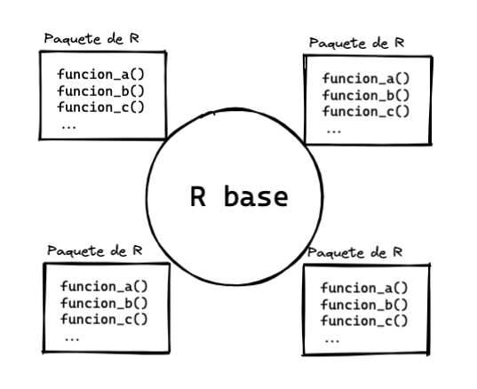

## Concepto

Como vimos hasta ahora, crear funciones tiene su complejidad. Pero en muchas ocasiones podemos usar las funciones que otros usuarios desarrollan y comparten libremente dentro de "paquetes", y que extieneden la funcionalidad de R.

{width=50%}

Los paquetes son un conjunto relacionado de funciones que crean otros usuarios de R para resolver problemas específicos, y que podemos buscar, instalar, cargar y usar.

- Buscar: podemos poner en un buscador las palabras "R package" + "tópico".
- Una vez encontrado el paquete de interés podemos instalarlo directamente desde R con la función `install.packages()` que recibe el nombre del paquete como caracter (en comillas)
- Dentro del script que estemos escribiendo debemos cargar el paquete con la función `library()` a la que le pasamos el nombre del paquete como objeto (sin comillas)
- Ahora sí podemos usar las funciones que están dentro del paquete

Esto hace que R no solo sea un programa aislado más, sino que también es un ecosistema de paquetes y comunidades de usuarios que extienden la funcionalidad de R. En el futuro tú mismo puedes contribuir con tus propios paquetes.

Daremos dos ejemplos de uso de paquetes. Primero con `tidyverse` para hacer transformación, análisis y visualizaciones de datos con funciones modernas y legibles, y luego con el paquete `rtweet` para recolectar datos de Twitter.

## Tidyverse

[Tidyverse](https://www.tidyverse.org/) es una colección de paquetes de R con una misma filosofía, sintaxis y estructura de datos. La filosofía es que es mucho más intuitivo y eficiente trabajar sobre tablas "tidy" (bien ordenadas), que consisten en tablas donde cada columna es una variable, cada fila es una sola única observación y cada celda contiene un solo valor:

{width=50%}
Una tabla que no es "tidy" es, por ejemplo, una tabla de Excel donde hay celdas combinadas, encabezados extra, texto de adorno, celdas de resultados que no siguen la lógica común o filas repetidas, una variable en más de una columna, etc. Tampoco son tablas "tidy" las tablas dinámicas o pivoteadas y las tablas de resultados o resumen.

Las tablas de este estilo se guardan en un data frame especial llamado "tibble" y que se crean automáticamente usando alguna función de lectura de datos de tidyverse como `read_csv()` o manualmente con la función `tibble()`.

Para instalar podemos hacer lo siguiente:

```{r, eval=F}
install.packages("tidyverse") # instala
```

Y para cargarlo usaremos `library(tidyverse)`.

Dentro de tidyverse hay varios paquetes que nos serviran para los procedimientos de análisis de datos. Los más básicos son:

- `readr`, `readxl` y `haven` para leer CSVs, Excels y archivos de otros programas estadísticos, respectivamente
- `dplyr` para transformar datos
- `ggplot` para crear gráficos

### Pipes y verbos

Tidyverse, para lograr mayor expresibidad y legibilidad, sigue dos principios:

- en los procedimientos, en vez de usar variables intermedias o el anidamiento de funciones, se privilegia el uso de una secuencia apoyada en "tuberias" (*pipes*) que se representan con el símbolo `%>%` y que hace que los datos fluyan de arriba hacía abajo
- se usan verbos de acción en sus funciones, que se pueden encadenar con los "pipes" 

Por ejemplo, podemos reescribir la función aninada de la desviación estandar que escribimos anteriormente a la siguiente forma:

```{r}
library(tidyverse) # cargamos el paquete
library(magrittr)

# Datos de ejemplo
x <- c(10, 20, 30, 40)

# Con anidamiento de funciones
sqrt(sum((x - mean(x)) ^ 2) / (length(x) - 1))

# Con pipes
x %>%
  subtract(mean(x)) %>%
  raise_to_power(2) %>%
  sum() %>%
  divide_by(length(x) - 1) %>%
  sqrt()
```

En el anidamiento de funciones las operaciones van de adentro hacía afuera, que es algo dificil de seguir para los humanos. En la versión con pipes, la operaciones van de arriba hacía abajo y son más fáciles de seguir, pero es necesario usar el operador del pipe para pasar el resultado del paso previo al siguiente.


