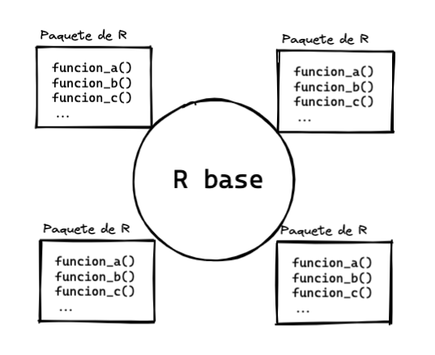

# Tidyverse

# Paquetes

## Concepto

Como vimos hasta ahora, crear funciones tiene su complejidad. Pero en
muchas ocasiones podemos usar las funciones que otros usuarios
desarrollan y comparten libremente dentro de “paquetes”, y que
extieneden la funcionalidad de R.



Los paquetes son un conjunto relacionado de funciones que crean otros
usuarios de R para resolver problemas específicos, y que podemos buscar,
instalar, cargar y usar:

-   Buscar: podemos poner en un buscador las palabras “R package” +
    “tópico”.
-   Una vez encontrado el paquete de interés podemos instalarlo
    directamente desde R con la función `install.packages()` que recibe
    el nombre del paquete como caracter (en comillas)
-   Dentro del script que estemos escribiendo debemos cargar el paquete
    con la función `library()` a la que le pasamos el nombre del paquete
    como objeto (sin comillas)
-   Ahora sí podemos usar las funciones que están dentro del paquete

Esto hace que R no solo sea un programa aislado más, sino que también es
un ecosistema de paquetes y comunidades de usuarios que extienden la
funcionalidad de R. En el futuro tú mismo puedes contribuir con tus
propios paquetes.

Daremos dos ejemplos de uso de paquetes. Primero con `tidyverse` para
hacer transformación, análisis y visualizaciones de datos con funciones
modernas y legibles, y luego con el paquete `rtweet` para recolectar
datos de Twitter.

## Tidyverse

[Tidyverse](https://www.tidyverse.org/) es una colección de paquetes de
R con una misma filosofía, sintaxis y estructura de datos. La filosofía
es que es mucho más intuitivo y eficiente trabajar sobre tablas “tidy”
(bien ordenadas), que consisten en tablas donde cada columna es una
variable, cada fila es una sola única observación y cada celda contiene
un solo valor:

 Una
tabla que no es “tidy” es, por ejemplo, una tabla de Excel donde hay
celdas combinadas, encabezados extra, texto de adorno, celdas de
resultados que no siguen la lógica común o filas repetidas, una variable
en más de una columna, etc. Tampoco son tablas “tidy” las tablas
dinámicas o pivoteadas y las tablas de resultados o resumen.

Las tablas de este estilo se guardan en un data frame especial llamado
“tibble” y que se crean automáticamente usando alguna función de lectura
de datos de tidyverse como `read_csv()` o manualmente con la función
`tibble()`.

Para instalar podemos hacer lo siguiente:

``` r
install.packages("tidyverse") # instala
```

Y para cargarlo usaremos `library(tidyverse)`.

Dentro de tidyverse hay varios paquetes que nos serviran para los
procedimientos de análisis de datos. Los más básicos son:

-   `readr`, `readxl` y `haven` para leer CSVs, Excels y archivos de
    otros programas estadísticos, respectivamente
-   `dplyr` para transformar datos
-   `ggplot` para crear gráficos

### Pipes y verbos

Tidyverse, para lograr mayor expresibidad y legibilidad, sigue dos
principios:

-   en los procedimientos, en vez de usar variables intermedias o el
    anidamiento de funciones, se privilegia el uso de una secuencia
    apoyada en “tuberias” (*pipes*) que se representan con el símbolo
    `%>%` y que hace que los datos fluyan de arriba hacía abajo
-   se usan verbos de acción en sus funciones, que se pueden encadenar
    con los “pipes”

Por ejemplo, podemos reescribir la función aninada de la desviación
estandar que escribimos anteriormente a la siguiente forma:

``` r
library(tidyverse) # cargamos el paquete
```

    ## ── Attaching packages ───────────────── tidyverse 1.3.1 ──

    ## ✔ ggplot2 3.3.6     ✔ purrr   0.3.4
    ## ✔ tibble  3.1.7     ✔ dplyr   1.0.9
    ## ✔ tidyr   1.2.0     ✔ forcats 0.5.1

    ## ── Conflicts ──────────────────── tidyverse_conflicts() ──
    ## ✖ dplyr::filter() masks stats::filter()
    ## ✖ dplyr::lag()    masks stats::lag()

``` r
library(magrittr)
```

    ## 
    ## Attaching package: 'magrittr'

    ## The following object is masked from 'package:purrr':
    ## 
    ##     set_names

    ## The following object is masked from 'package:tidyr':
    ## 
    ##     extract

``` r
# Datos de ejemplo
x <- c(10, 20, 30, 40)

# Con anidamiento de funciones
sqrt(sum((x - mean(x)) ^ 2) / (length(x) - 1))
```

    ## [1] 12.90994

``` r
# Con pipes
x %>%
  subtract(mean(x)) %>%
  raise_to_power(2) %>%
  sum() %>%
  divide_by(length(x) - 1) %>%
  sqrt()
```

    ## [1] 12.90994

En el anidamiento de funciones las operaciones van de adentro hacía
afuera, que es algo dificil de seguir para los humanos. En la versión
con pipes, la operaciones van de arriba hacía abajo y son más fáciles de
seguir, pero es necesario usar el operador del pipe para pasar el
resultado del paso previo al siguiente.

# Filtrar y seleccionar

Dos operaciones muy comunes y básicas al trabajar con tablas de datos
(tibbles en tidyverse) se refieren a poder seleccionar un número
especifico de filas y columnas. Para ello en el caso de las filas
podemos usar la función de filtrar (`filter()`) y seleccionar para las
columnas (`select()`).

Usaremos el dataset de `gapminder`, un dataset económico. para todos los
ejemplos. Tiene seis variables:

-   `country`: pais
-   `continent`: continente
-   `year`: año
-   `lifeExp`: esperanza de vida
-   `pop`: población total
-   `gdpPercap`: PIB per capita

``` r
# cargar tydiverse
library(tidyverse)

# cargar los datos desde el CSV
data <- read_csv("../data/gapminder.csv")
```

    ## Rows: 1704 Columns: 6
    ## ── Column specification ──────────────────────────────────
    ## Delimiter: ","
    ## chr (2): country, continent
    ## dbl (4): year, lifeExp, pop, gdpPercap
    ## 
    ## ℹ Use `spec()` to retrieve the full column specification for this data.
    ## ℹ Specify the column types or set `show_col_types = FALSE` to quiet this message.

``` r
# Ver los datos
data
```

    ## # A tibble: 1,704 × 6
    ##    country     continent  year lifeExp      pop gdpPercap
    ##    <chr>       <chr>     <dbl>   <dbl>    <dbl>     <dbl>
    ##  1 Afghanistan Asia       1952    28.8  8425333      779.
    ##  2 Afghanistan Asia       1957    30.3  9240934      821.
    ##  3 Afghanistan Asia       1962    32.0 10267083      853.
    ##  4 Afghanistan Asia       1967    34.0 11537966      836.
    ##  5 Afghanistan Asia       1972    36.1 13079460      740.
    ##  6 Afghanistan Asia       1977    38.4 14880372      786.
    ##  7 Afghanistan Asia       1982    39.9 12881816      978.
    ##  8 Afghanistan Asia       1987    40.8 13867957      852.
    ##  9 Afghanistan Asia       1992    41.7 16317921      649.
    ## 10 Afghanistan Asia       1997    41.8 22227415      635.
    ## # … with 1,694 more rows

Si quisieramos filtrar solo el pais de Bolivia, entonces:

-   Declaramos el nombre de la variable que referencia a los datos
-   Pasamos un pipe
-   Usamos la función `filter()` que recibe una o más expresiones
    comparativas y lógicas:

``` r
# Filtrar pais de Bolivia
data %>%
  filter(country == "Bolivia", lifeExp < 50)
```

    ## # A tibble: 5 × 6
    ##   country continent  year lifeExp     pop gdpPercap
    ##   <chr>   <chr>     <dbl>   <dbl>   <dbl>     <dbl>
    ## 1 Bolivia Americas   1952    40.4 2883315     2677.
    ## 2 Bolivia Americas   1957    41.9 3211738     2128.
    ## 3 Bolivia Americas   1962    43.4 3593918     2181.
    ## 4 Bolivia Americas   1967    45.0 4040665     2587.
    ## 5 Bolivia Americas   1972    46.7 4565872     2980.

``` r
# Filtrar pais de Bolivia y cuándo tuvieron una esperanza de vida menor de 50 años
data %>%
  filter(country == "Bolivia", lifeExp < 50)
```

    ## # A tibble: 5 × 6
    ##   country continent  year lifeExp     pop gdpPercap
    ##   <chr>   <chr>     <dbl>   <dbl>   <dbl>     <dbl>
    ## 1 Bolivia Americas   1952    40.4 2883315     2677.
    ## 2 Bolivia Americas   1957    41.9 3211738     2128.
    ## 3 Bolivia Americas   1962    43.4 3593918     2181.
    ## 4 Bolivia Americas   1967    45.0 4040665     2587.
    ## 5 Bolivia Americas   1972    46.7 4565872     2980.

Adicionalmente podemos usar la función `arrange()` para ordenar la tabla
por un criterio de ascendente o descendente y usando alguna columna:

``` r
# Ordenar: arrange() (menor a mayor); mayor a menor con desc()
data %>%
  filter(country == "Bolivia", lifeExp < 50) %>%
  arrange(desc(gdpPercap))
```

    ## # A tibble: 5 × 6
    ##   country continent  year lifeExp     pop gdpPercap
    ##   <chr>   <chr>     <dbl>   <dbl>   <dbl>     <dbl>
    ## 1 Bolivia Americas   1972    46.7 4565872     2980.
    ## 2 Bolivia Americas   1952    40.4 2883315     2677.
    ## 3 Bolivia Americas   1967    45.0 4040665     2587.
    ## 4 Bolivia Americas   1962    43.4 3593918     2181.
    ## 5 Bolivia Americas   1957    41.9 3211738     2128.

Los anteriores procedimientos solo muestran el resultado, pero no lo
guardan. Para guardar explicitamente debemos asignar el resultado a una
variable, con lo cual podemos trabajar solo con ese subconjunto. Por
ejemplo:

``` r
bolivia <- data %>%
  filter(country == "Bolivia", lifeExp < 50)
```

Ahora bien para seleccionar columnas usamos `select()` y le pasamos una
o más columnas

``` r
bolivia %>%
  select(year, pop)
```

    ## # A tibble: 5 × 2
    ##    year     pop
    ##   <dbl>   <dbl>
    ## 1  1952 2883315
    ## 2  1957 3211738
    ## 3  1962 3593918
    ## 4  1967 4040665
    ## 5  1972 4565872

Naturalmente podemos combinar `filter()` con `select()` y `arrange()`:

``` r
data %>%
  select(country, year, gdpPercap) %>%
  filter(country == "Bolivia") %>%
  arrange(desc(gdpPercap))
```

    ## # A tibble: 12 × 3
    ##    country  year gdpPercap
    ##    <chr>   <dbl>     <dbl>
    ##  1 Bolivia  2007     3822.
    ##  2 Bolivia  1977     3548.
    ##  3 Bolivia  2002     3413.
    ##  4 Bolivia  1997     3326.
    ##  5 Bolivia  1982     3157.
    ##  6 Bolivia  1972     2980.
    ##  7 Bolivia  1992     2962.
    ##  8 Bolivia  1987     2754.
    ##  9 Bolivia  1952     2677.
    ## 10 Bolivia  1967     2587.
    ## 11 Bolivia  1962     2181.
    ## 12 Bolivia  1957     2128.

# Resumir y mutar

Filtrar y seleccionar nos permiten reducir las filas y columnas de un
data frame. Pero en otras ocasiones necesitaremos también hacer
cálculos, a nivel de columna o filas. Para sacar resultados a nivel de
columna y comprimir la fila a un solo valor, utilizaremos `summarize()`.
Mientras que para hacer un cálculo de todos los valores de una columna,
fila por fila, utilizaremos `mutate()`, que crea nuevas columnas.

Por ejemplo, si queremos extraer la mediana de la esperanza de vida:

-   A `summarize()` le pasamos una expresión de asignación con el
    operador `=`, donde a la izquierda creamos un nombre y a la derecha
    alguna expresión que puede usar las variables del data frame:

``` r
# Calcular mediana de la esperanza de vida
data %>%
  summarize(mediana_esp_vida = median(lifeExp))
```

    ## # A tibble: 1 × 1
    ##   mediana_esp_vida
    ##              <dbl>
    ## 1             60.7

Podemos combinarlo con `filter()` y calcular varios resumenes:

``` r
# Resumir
data %>%
  filter(year == 1952) %>%
  summarize(mediana_esp_1952 = median(lifeExp), media_pib_1952 = mean(gdpPercap))
```

    ## # A tibble: 1 × 2
    ##   mediana_esp_1952 media_pib_1952
    ##              <dbl>          <dbl>
    ## 1             45.1          3725.

Ahora bien para calcular nuevas columnas y agregarlas al data frame,
usaremos `mutate()`. Por ejemplo, calculando la esperanza de vida en
meses:

``` r
data %>%
  mutate(lifeExpMes = lifeExp * 12)
```

    ## # A tibble: 1,704 × 7
    ##    country     continent  year lifeExp      pop gdpPercap
    ##    <chr>       <chr>     <dbl>   <dbl>    <dbl>     <dbl>
    ##  1 Afghanistan Asia       1952    28.8  8425333      779.
    ##  2 Afghanistan Asia       1957    30.3  9240934      821.
    ##  3 Afghanistan Asia       1962    32.0 10267083      853.
    ##  4 Afghanistan Asia       1967    34.0 11537966      836.
    ##  5 Afghanistan Asia       1972    36.1 13079460      740.
    ##  6 Afghanistan Asia       1977    38.4 14880372      786.
    ##  7 Afghanistan Asia       1982    39.9 12881816      978.
    ##  8 Afghanistan Asia       1987    40.8 13867957      852.
    ##  9 Afghanistan Asia       1992    41.7 16317921      649.
    ## 10 Afghanistan Asia       1997    41.8 22227415      635.
    ## # … with 1,694 more rows, and 1 more variable:
    ## #   lifeExpMes <dbl>

También podemos agregar varias columnas al mismo tiempo. Y si queremos
que los cambios se guarden en la tabla original, la debemos
sobreescribir:

``` r
data <- data %>%
  mutate(lifeExpMes = lifeExp * 12, popMillon = pop / 1000000)
data
```

    ## # A tibble: 1,704 × 8
    ##    country     continent  year lifeExp      pop gdpPercap
    ##    <chr>       <chr>     <dbl>   <dbl>    <dbl>     <dbl>
    ##  1 Afghanistan Asia       1952    28.8  8425333      779.
    ##  2 Afghanistan Asia       1957    30.3  9240934      821.
    ##  3 Afghanistan Asia       1962    32.0 10267083      853.
    ##  4 Afghanistan Asia       1967    34.0 11537966      836.
    ##  5 Afghanistan Asia       1972    36.1 13079460      740.
    ##  6 Afghanistan Asia       1977    38.4 14880372      786.
    ##  7 Afghanistan Asia       1982    39.9 12881816      978.
    ##  8 Afghanistan Asia       1987    40.8 13867957      852.
    ##  9 Afghanistan Asia       1992    41.7 16317921      649.
    ## 10 Afghanistan Asia       1997    41.8 22227415      635.
    ## # … with 1,694 more rows, and 2 more variables:
    ## #   lifeExpMes <dbl>, popMillon <dbl>

# Agrupar

En los data frame, los valores de algunas columnas reflejan grupos. Para
el caso de gapminder están `continent` y `year`, por ejemplo. Entonces
muchas veces necesitaremos hacer calculos por grupos para compararlos,
para ello está la función `group_by()`.

Por ejemplo, podemos agrupar por continente y recién extraer un calculo
de la mediana:

``` r
data %>%
  group_by(continent) %>%
  summarize(mediana_esp = median(lifeExp))
```

    ## # A tibble: 5 × 2
    ##   continent mediana_esp
    ##   <chr>           <dbl>
    ## 1 Africa           47.8
    ## 2 Americas         67.0
    ## 3 Asia             61.8
    ## 4 Europe           72.2
    ## 5 Oceania          73.7

O agrupar por una combinación de variables, como continente y año, y que
nos permite comparar con más valores:

``` r
data %>%
  group_by(continent, year) %>%
  summarize(mediana_esp = median(lifeExp))
```

    ## `summarise()` has grouped output by 'continent'. You can
    ## override using the `.groups` argument.

    ## # A tibble: 60 × 3
    ## # Groups:   continent [5]
    ##    continent  year mediana_esp
    ##    <chr>     <dbl>       <dbl>
    ##  1 Africa     1952        38.8
    ##  2 Africa     1957        40.6
    ##  3 Africa     1962        42.6
    ##  4 Africa     1967        44.7
    ##  5 Africa     1972        47.0
    ##  6 Africa     1977        49.3
    ##  7 Africa     1982        50.8
    ##  8 Africa     1987        51.6
    ##  9 Africa     1992        52.4
    ## 10 Africa     1997        52.8
    ## # … with 50 more rows

# Graficos con ggplot

Podemos generar muchos tipos de gráficos con el paquete `ggplot`. Este
genera gráficos a partir de declarar: - Los datos que se usarán - La
función `ggplot()` que lleva dentro una función de mapeos estéticos con
`aes()` y que recibe argumentos como `x`, `y`, `color`, `size` donde
debes pasar las variables del dataset que te interese gráficar. - Una
capa de geometrias precedida del simbolo `+`: `geom_point()`,
`geom_line()`, `geom_histogram()`, `geom_bar()`, etc. - Opcionalmene
otras capas para modificar las escalas o el sistema de coordenadas,
entre otras.

``` r
# Graficar en PIB per capita con esperanza de vida en una gráfico de puntos
data %>%
  filter(year == 1952) %>%
  ggplot(aes(x = gdpPercap, y = lifeExp)) +
  geom_point() +
  scale_x_log10() # para que los puntos no se vea tan ajustados
```

<!-- -->

## Gráfico de barras

``` r
# Graficos de barras: geom_bar() y geom_col()
# Número de paises en cada continente
data %>%
  filter(year == 2007) %>%
  ggplot(aes(x = continent)) +
  geom_bar()
```

<!-- -->

## Histogramas

``` r
# Histogramas con geom_histogram()
# Distribución de población en el año de 1952
data_1952 <- data %>%
  filter(year == 1952)
 
data_1952 %>%
  ggplot(aes(pop)) +
  geom_histogram() +
  scale_x_log10()
```

    ## `stat_bin()` using `bins = 30`. Pick better value with
    ## `binwidth`.

<!-- -->

## Grafico de lineas

``` r
# Graficos de lineas: geom_line()
grupos <- data %>%
  group_by(continent, year) %>%
  summarize(mediana_esp = median(lifeExp))
```

    ## `summarise()` has grouped output by 'continent'. You can
    ## override using the `.groups` argument.

``` r
grupos %>%
  ggplot(aes(x = year, y = mediana_esp, color = continent)) +
  geom_line()
```

<!-- -->

## Diagrama de cajas (boxplots)

``` r
# Diagrama con geom_boxplot()
# Distribución de gdpPercap entre los continentes
data_1952 %>%
  ggplot(aes(x = continent, y = gdpPercap)) +
  geom_boxplot() +
  scale_y_log10()
```

<!-- -->

## Facetados

Es posible también crear una suerte de matriz de datos con los facetados
(`facet_wrap()`):

``` r
# Facetados o matrices de gráficos
data %>%
  ggplot(aes(x = gdpPercap, y = lifeExp, color = continent, size = pop)) +
  geom_point() +
  scale_x_log10() +
  facet_wrap(~year)
```

<!-- -->

[\<\<
Anterior](https://github.com/lab-tecnosocial/curso-r/tree/main/04-estructuras-de-control)
\| [Siguiente
\>\>](https://github.com/lab-tecnosocial/curso-r/tree/main/06-analisis-de-tweets)
